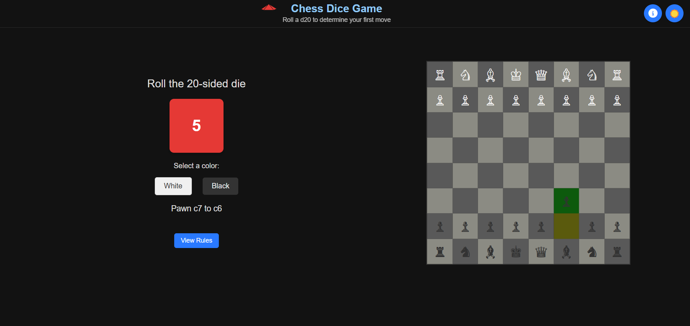

# Chess Dice Game

A web-based chess opening move randomizer that uses a virtual 20-sided die to determine your first move in a chess game.



## Overview

Chess Dice Game offers a fun and unpredictable way to start your chess games. Roll a virtual 20-sided die and get a randomly selected opening move for either white or black pieces. The app shows the move on an interactive chessboard with animations, helping players visualize the opening position.

This project was inspired by Magnus Carlsen's Titled Tuesday stream on March 18, 2025, where the 16th World Chess Champion experimented with random opening moves.

## Features

- Virtual 20-sided die for random move selection
- Choice between white and black pieces
- Interactive chessboard that shows the selected move
- Visual animation of the chess piece movement
- Dark/light theme with system preference detection
- Mobile responsive design
- Comprehensive rules reference
- Works offline once loaded

## Live Demo

Try the live demo: [Chess Dice Game on Vercel](https://chess-dice.vercel.app)

## How to Use

1. Roll the die by clicking on the red 20-sided die
2. Select white or black pieces
3. View your randomly assigned opening move on the animated chessboard
4. Click "View Rules" to see all possible moves
5. Use the theme toggle to switch between light and dark mode

## Possible Moves

The randomizer includes 20 possible opening moves for each color:
- 16 pawn moves (each pawn can move one or two squares)
- 4 knight moves (the only other piece that can move on the first turn)

All moves follow standard chess rules for opening positions.

## Future Improvements

Here are some potential features and improvements that could be added in future updates:

1. **Weighted Probabilities**: Adjust the probability of each move based on statistical data from master games or popular opening theory
2. **Custom Weighting**: Allow users to manually adjust the probabilities of certain moves to favor specific openings
3. **Opening Names**: Display the chess opening name that corresponds to the selected move
4. **Statistical Insights**: Show win rates and popularity of each opening move based on chess databases
5. **Position Evaluation**: Add engine evaluation of the position after the move
6. **Move Export**: Allow exporting the selected move in PGN format
7. **User Accounts**: Save favorite moves or custom probability settings
8. **Puzzle Integration**: Suggest puzzles that arise from the selected opening

## Technical Details

- Built with vanilla JavaScript, HTML5, and CSS3
- No dependencies or frameworks required
- Responsive design works on all device sizes
- Dark mode support using CSS variables and media queries
- Deployed on Vercel's static hosting platform

## Local Development

1. Clone the repository
   ```
   git clone https://github.com/yourusername/chess-dice.git
   ```

2. Open the project folder
   ```
   cd chess-dice
   ```

3. Open `index.html` in your browser or use a local server
   ```
   # Using Python's built-in server
   python -m http.server
   ```

4. Visit `http://localhost:8000` in your browser

## Credits

Developed by Emmanuel Oluyoyin

- [LinkedIn](https://linkedin.com/in/timmecom)
- [Email](mailto:oluyoyin2000@gmail.com)

## License

This project is licensed under the Apache License 2.0 - see the [LICENSE](LICENSE) file for details.
